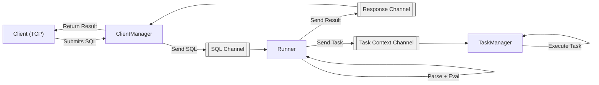
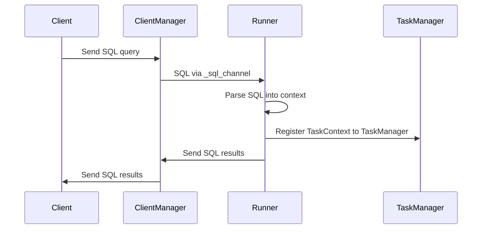
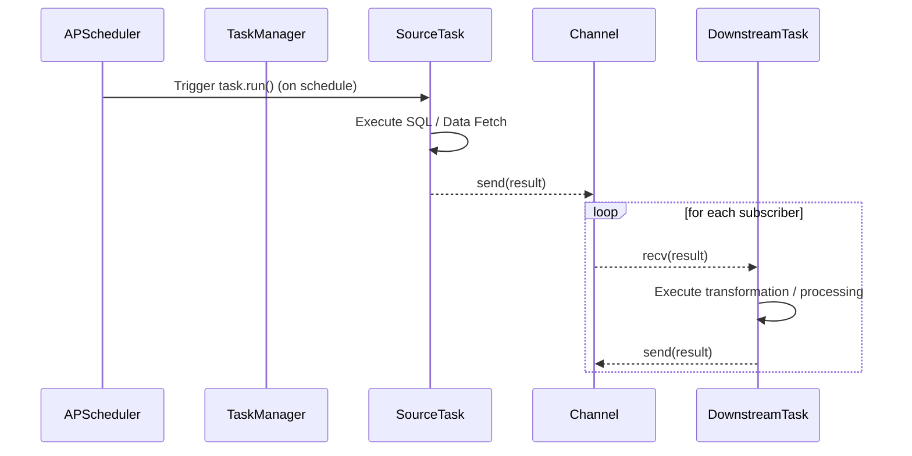

# OMLSP
OMLSP is a single-node streaming processor written in Python, inspired by RisingWave and Apache Flink.

It enables you to define streaming data pipelines using SQL transformations, following a Flink-like syntax (extended ANSI-sql).

OMLSP is primarily designed to handle HTTP-based data sources and perform HTTP lookups, making it ideal for integrating with APIs, webhooks, and microservices.

## What OMLSP Does

OMLSP orchestrates data flow pipelines from HTTP sources to output sinks with:

- Strong typing – Schema-first design for reliable pipelines.
- SQL-first transformations – Use familiar SQL to define dataflows and streaming logic.
- Dynamic lookups – Combine live HTTP endpoints with batch data for enriched transformations.
- DuckDB-powered execution – Leverages DuckDB
 for ultra-fast, in-process analytics.

The engine continuously fetches, transforms, and routes data asynchronously using Trio
, with channels acting as internal communication streams (similar to Go channels).

## Examples
Basic example, this table will call every 60s the endpoint of httbin for GET method and store the url inside a 'url' column.
```sql
-- Create a table which keeps all tickers list in batch
CREATE TABLE all_tickers (
    symbol STRING,
    symbolName STRING,
    buy FLOAT,
    sell FLOAT
)
WITH (
    'connector' = 'http',
    'url' = 'https://api.kucoin.com/api/v1/market/allTickers',
    'method' = 'GET',
    'schedule' = '*/1 * * * *',
    'jq' = '.data.ticker[:2][] | {symbol, symbolName, buy, sell}',
    'headers.Content-Type' = 'application/json'
);

-- Create an output destination to kafka
CREATE SINK all_tickers_sink_bis FROM (SELECT symbolName, buy FROM all_tickers)
WITH (
    connector = 'kafka',
    topic = 'tickers_topic_2',
    server = 'localhost:9092',
);
```

## Architecture
This project implements a lightweight asynchronous SQL orchestration engine using DuckDB and Trio.

The central component is the Runner class, which coordinates client SQL submissions, query evaluation, and task scheduling, using asynchronous channels (similar to Go channels).

Everything happens asynchronously, with each component communicating through Channel objects.

### Flowchart



### Channels
| Channel Name       | Type                       | Purpose                                  |
| ------------------ | -------------------------- | ---------------------------------------- |
| `sql`     | `Channel[tuple[str, str]]` | SQL queries from client → runner         |
| `client / response`  | `Channel[tuple[str, str]]` | Execution results from runner → client   |
| `task context` | `Channel[TaskContext]`     | Task contexts from runner → task manager |

### Sequence


## Stream Processor



# Improvements

| Area                | Current                       | Suggested Improvement                              |
| ------------------- | ----------------------------- | -------------------------------------------------- |
| **Task structure**  | Single `Task` class           | Separate `SourceTask`, `TransformTask`, `SinkTask` |
| **DAG definition**  | Built inline in `TaskManager` | Use `Pipeline` / `Topology` builder object                      |
| **Channels**        | Fixed-size only               | Add backpressure and overflow strategies           |
| **Error handling**  | Minimal                       | Add retries, error channels, graceful shutdown     |
| **Scheduler**       | APScheduler only              | Abstract scheduler interface                       |
| **Parallelism**     | 1 instance per task           | Configurable concurrency                           |
| **Recovery**        | None                          | Add persistence & checkpointing                    |
| **Monitoring**      | None                          | Metrics, tracing, visualization                    |
| **Dynamic changes** | Static DAG                    | Support runtime DAG updates                        |
